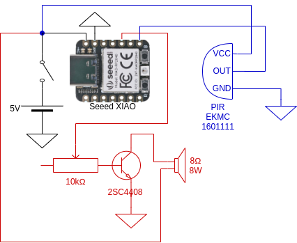

# Circuit



- blue components handle motion detection
- red components handle audio

# Photos

[front isometric](images/xiao-proximity-audio-player-front-isometric.jpg)
[side bottom](images/xiao-proximity-audio-player-side-bottom.jpg)
[open 1](images/xiao-proximity-audio-player-open-1.jpg)
[open 2](images/xiao-proximity-audio-player-open-2.jpg)

# Notes
- this program currently plays up to 16 bit sample files at an arbitrary, fixed sample rate
  - the bundled samples.h file has a sample rate of 44.1kHz and a dynamic range of 3015 values (~ 11.6 bits)
- 8 bit sound was pretty noisy when compared to the 16 bit original, 11.6 bits are so much less noisy than 8 bits
  - I also tried the following circuit from [here](https://theorycircuit.com/simple-single-transistor-audio-amplifier-circuit/), which features a resistor/capacitor combo, as is common in amp circuits, but sound did not improve - to my ears

- the range of the PIR sensor was way too high (up to 7m), so I put a couple of [polyethylene sheets](#5-polyethylene-bags-0-03mm-3-85-yen-77-yen-20) in front of it
  - this meant there weren't any false alarms in my tests on the street where I plan to use it (though I'm sure there will be some in practice), so I could disable the "5 second averaging" smooting mechanism in my code, which leads to a less delayed reaction to motion

# Build instructions
- install pico-sdk (to ~/pico-sdk)
  - if pico-sdk is located in a different directory, change PICO_SDK_PATH in CMakeLists.txt
- if using a board other than seeed_xiao_rp2040, set PICO_BOARD in CMakeLists.txt accordingly
- make XIAO accessible via USB mass storage: while pressing and holding the BOOT button, press the RESET button
```
mkdir build
cd build
cmake ..
make

# deploy binary: (assuming the XIAO is mounted at /media/$USERNAME/RPI-RP2)
cp xiao-rp2040-audio-player.uf2 /media/$USERNAME/RPI-RP2/
```

# Convert audio file to samples.h
The *rate* parameter `-r` below can changed, but don't forget to set `SAMPLE_RATE` in main.c accordingly
```
SAMPLE_RATE=44100 # Hz
SAMPLE_BITS=16
INPUT_FILE=teatime.flac
PWM_WRAP=3015
sox $INPUT_FILE -c1 -r$SAMPLE_RATE -tdat - \
| tail -n+3 \
| awk '
    BEGIN {
        mul='$PWM_WRAP'/2.0
        printf "// input file: '$INPUT_FILE'\n"
        printf "#define SAMPLE_RATE '$SAMPLE_RATE'\n"
        printf "#define SAMPLE_BITS '$SAMPLE_BITS'\n"
        printf "#define PWM_WRAP '$PWM_WRAP'\n"
        printf "const uint'$SAMPLE_BITS'_t __in_flash() audio_buffer[] = {\n"
    }
  { printf "  %.0f,\n", ($2 + 1) * mul }
  END { printf "};\n"}' \
> samples.h
```
# Parts

## Seeed [XIAO RP2040](https://www.seeedstudio.com/XIAO-RP2040-v1-0-p-5026.html) [790 Yen](https://www.marutsu.co.jp/pc/i/2229736/)

- [RP2040 chip datasheet](https://datasheets.raspberrypi.com/rp2040/rp2040-datasheet.pdf)
- [Getting started with Raspberry Pi Pico](https://datasheets.raspberrypi.com/pico/getting-started-with-pico.pdf) (C/C++ development with RP2040-based boards)
- [Raspberry Pi Pico C/C++ SDK](https://datasheets.raspberrypi.com/pico/raspberry-pi-pico-c-sdk.pdf) (Libraries and tools for C/C++ development on RP2040 microcontrollers)
  - the Seeed XIAO RP2040 board has been added to the [pico-sdk](https://github.com/raspberrypi/pico-sdk) in [version 1.3.1](https://github.com/raspberrypi/pico-sdk/releases/tag/1.3.1) on 2022/5/19

## PIR: Panasonic Electric Works [EKMC1601111](https://www3.panasonic.biz/ac/e/search_num/index.jsp?c=detail&part_no=EKMC1601111) [500 Yen](https://akizukidenshi.com/catalog/g/gM-09750/)

[Datasheet](https://mediap.industry.panasonic.eu/assets/download-files/import/ds_ekmc160111_v63_en.pdf)

| Type                  | Description            |
|-----------------------|------------------------|
| Sensor Type           | PIR (Passive Infrared) |
| Sensing Distance      | 197" (5m) 16.4'        |
| Output Type           | Digital                |
| Voltage - Supply      | 3V ~ 6V                |
| Trigger Type          | Internal               |
| Features              | Standard Lens, White   |
| Operating Temperature | -20°C ~ 60°C (TA)      |
| Detection Pattern     | Standard               |

## Speaker 8Ω 8W P-03285 [100 Yen](https://akizukidenshi.com/catalog/g/gP-03285/)

[Datasheet](https://akizukidenshi.com/download/p3285.pdf)

| Type                 | Description    |
|----------------------|----------------|
| Size                 | 50mm / 2inch   |
| Rated Impedance      | 8Ω             |
| Nominal Power        | 8W w/NETWORK   |
| Frequency Range      | 2k ~ 20kHx     |
| Sound Pressure Level | 87dB           |
| Voice Coil Diameter  | 13mm           |
| Magnet Mass          | 25.8g / 0.91oz |
| Total Mass           | 100g           |

## Transistor 2SC4408

[Datasheet](https://cdn.datasheetspdf.com/pdf-down/C/4/4/C4408_ToshibaSemiconductor.pdf)

### Alternative transistor: 2SD2012

After heating up my 2SC4408 too much during soldering - at least that's what I'm guessing - it stopped amplifying, so I went for this transistor, that I had lying around.

[Datasheet](https://alltransistors.com/adv/pdfdatasheet_st/2sd2012_2.pdf)

### Absolute Maximum Ratings (Ta = 25°C)

| Characteristics             | Symbol | Rating     | Unit |
|-----------------------------|--------|------------|------|
| Collector-base voltage      | V_CBO  | 80         | V    |
| Collector-emitter voltage   | V_CEO  | 50         | V    |
| Emitter-base voltage        | V_EBO  | 6          | V    |
| Collector current           | I_C    | 2          | A    |
| Base current                | I_B    | 0.2        | A    |
| Collector power dissipation | P_C    | 900        | mW   |
| Junction temperature        | Tj     | 150        | °C   |
| Storage temperature range   | Tstg   | −55 to 150 | °C   |

### Electrical Characteristics (Ta = 25°C)

| Characteristics                      | Symbol    | Test Condition                         | Min | Typ | Max | Unit |
|--------------------------------------|-----------|----------------------------------------|-----|-----|-----|------|
| Collector cut-off current            | I_CBO     | V_CB = 80 V, I_E = 0                   | ―   | ―   | 1.0 | μA   |
| Emitter cut-off current              | I_EBO     | V_EB = 6 V, I_C = 0                    | ―   | ―   | 1.0 | μA   |
| Collector-emitter breakdown voltage  | V_(BR)CEO | I_C = 10 mA, I_B = 0                   | 50  | ―   | ―   | V    |
| DC current gain                      | h_FE(1)   | V_CE = 2 V, I_C = 100 mA               | 120 | ―   | 400 |      |
| DC current gain                      | h_FE(2)   | V_CE = 2 V, I_C = 1.5 A                | 40  | ―   | ―   |      |
| Collector-emitter saturation voltage | V_CE(sat) | I_C = 1 A, I_B = 0.05 A                | ―   | ―   | 0.5 | V    |
| Base-emitter saturation voltage      | V_BE(sat) | I_C = 1 A, I_B = 0.05 A                | ―   | ―   | 1.2 | V    |
| Transition frequency                 | f_T       | V_CE = 2 V, I_C = 100 mA               | ―   | 100 | ―   | MHz  |
| Collector output capacitance         | C_ob      | V_CB = 10 V, I_C = 0, f = 1 MHz        | ―   | 14  | ―   | p    |
| Switching time Turn-on time          | t_on      | I_B1 = −I_B2 = 0.05 A, duty cycle ≤ 1% | ―   | 0.1 | ―   | μs   |
| Switching time Storage time          | t_stg     | I_B1 = −I_B2 = 0.05 A, duty cycle ≤ 1% | ―   | 0.5 | ―   | μs   |
| Switching time Fall time             | t_f       | I_B1 = −I_B2 = 0.05 A, duty cycle ≤ 1% | ―   | 0.1 | ―   | μs   |

## Variable Resistor 10kΩ

## 5 Polyethylene bags 0.03mm [3.85 Yen (77 Yen / 20)](https://store.shopping.yahoo.co.jp/oyakudachi-shop/taiyoupori-2-kakuhaibin.html)
- each of the 5 bags conists of 2 layers of 0.03mm polyethylene sheet, folded in half means we get a total thickness of `2 x 2 x 5 x 0.03mm = 0.6mm`
